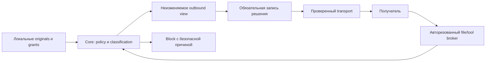

# T07: архитектура фильтрации исходящих данных

Статус: предложенная архитектура, принятая для разработки спецификации T07. Действующий Core, схемы и adapters не изменены. Основания: [исследование](investigation.md), [символы и хеши](source-map.json), [домен](privacy-domain.md), [угрозы](threat-model.md).

## Варианты и решение

| Вариант | Что даёт | Ограничение | Решение |
|---|---|---|---|
| Маскирование только prompt в каждом adapter | Быстрое сокращение очевидных утечек начального текста | Расхождение правил, обход через native reads, env и tool results | Не использовать как архитектуру всей сессии |
| Один sanitized workspace | Удобный снимок разрешённых файлов | Сам по себе не закрывает home/config/network/children; filenames тоже содержат данные | Допустим как один из механизмов квалифицированного backend |
| Core policy + immutable outbound view + broker + проверенный transport/backend | Общие решения независимо от provider, повторная проверка каждого раскрытия | Нужны отдельные доказательства ограничения каналов | Выбранный вариант |
| Только полностью локальные модели | Нет передачи модели внешнему endpoint при доказанной изоляции | Локальный процесс сам по себе не доказывает отсутствие сети; не покрывает remote use case | Отдельный route, не замена общей модели |

Core отвечает за policy, classification, проверку authorization/bindings, projection, budget и обязательный audit. Adapter отвечает за преобразование протокола и передачу только утверждённых bytes определённому endpoint. Broker отвечает за авторизованные обращения к локальным источникам и инструментам. Backend доказывает, что исполнитель не может обойти broker/transport. Конкретные provider SDK и механизмы ОС находятся за adapter/backend границей; policy не ветвится по названию модели.

Стрелка от получателя к broker означает запрос, а не прямой доступ. Каждый ответ, attachment, exception и metadata вновь проходят Core до передачи. Model output и tool arguments остаются недоверенными: фильтр раскрытия не даёт права выполнять действие, писать файл или вызывать привилегированный tool.

## Контракт и совместимость

Предлагается successor Execution Context contract v2 для Work, где egress policy входит в security intent. Это предложение новой версии, а не поле, уже поддерживаемое v1. Digest intent охватывает policy id/version/hash, detector bundle, recipient/purpose constraints, минимальный уровень контроля и budgets. Доверенный registry отдельно связывает recipient alias с endpoint и route; его версия входит в attempt binding. Нельзя дописать policy в старую capsule, изменить intent без successor или считать локальную настройку вне digest равнозначной контракту.

Существующий v1 без egress-запроса сохраняет прежнюю семантику и не получает отметку filtering/enforced. Запрос строгой egress-гарантии при v1/неполном binding завершается `egress_contract_required` до запуска. Старый reader отвергает незнакомую v2 по существующему правилу unsupported version. Миграция создаёт новый Work/context, сохраняет predecessor и все исходные хеши. По умолчанию конфигурация не должна молча переводить старые работы в режим с иной семантикой. Введение общего обязательного egress режима потребует отдельной миграционной задачи.

Проверка каждой операции использует пересечение pinned policy и текущих ограничений. Текущий запрет действует сразу на новые раскрытия. Ослабление pinned ограничений требует successor intent. Смена endpoint/purpose/route допускается лишь в пределах разрешённого intent с новой подготовкой attempt; вне этих пределов требуется successor. Уже отправленные данные отозвать нельзя.

## Уровни контроля

| Уровень | Условие заявления | Что не утверждается |
|---|---|---|
| `payload_only` | Core проверил точный начальный envelope, adapter передал ровно его | Последующие native reads, инструменты, сеть и конфигурация исполнителя не покрыты |
| `mediated_session` | Все источники и исходящие каналы проходят broker/transport; независимые FS/env/config/plugins/child/network пути закрыты и проверены для конкретной версии backend | Семантическая анонимность и защита от скомпрометированной ОС |
| `isolated_local` | Проверены ограничения файлов/процессов и отсутствие внешнего обмена; отдельная политика локального получателя | Что любой executable с меткой local безопасен или не имеет telemetry |

Это разные capability contracts, не числовой рейтинг доверия. `isolated_local` не удовлетворяет запрос remote delivery. Capability evidence привязано к backend/adapter версии, конфигурации, ОС и тестам обхода; изменение существенных параметров требует повторной квалификации. Неизвестный или неподтверждённый route не получает `enforced`. Для strict session существующие generic-shell/Codex paths из исследования считаются unsupported до будущей квалификации; текущий `allow_network: false` не принимается за доказательство сетевого запрета.

## Разделение локального manifest и передаваемого представления

Prepared input остаётся private canonical record для локального launcher. Remote envelope строится отдельным allowlist сериализатором, а не копированием JSON с удалением нескольких полей. В него не попадают `project_root`, пути capsule/snapshot, grants с локальными путями, hashes исходных коротких значений, baseline outputs, native environment, worker runtime metadata и свободный текст ошибок. Objective/instructions/source names также классифицицируются; safe path не означает safe content.

Разрешённый envelope содержит версию view, случайный attempt alias, проверенные task fields, units, opaque resource handles и объявленные разрешённые операции. Локальная private map связывает handles с originals и grants. Handles непредсказуемы, ограничены attempt/stage/recipient/purpose, недоступны после завершения/revocation; строка handle сама по себе не даёт полномочий. Broker аутентифицирует текущую сессию и заново проверяет scope и policy. Возврат локального пути вместо handle запрещён.

Канонические grants нельзя маскировать и затем использовать как источник прав. Ограничения локально применяет broker, модель получает лишь безопасное описание доступных действий. Если обязательный смысл objective/contract нельзя сохранить в recipient view, операция блокируется `required_semantics_lost`. Никакого автоматического исполнения восстановленной из placeholder команды: разрешённый effect и mapping проверяются независимо от текста модели.

## Обработка и отправка

1. Проверить immutable context, stage, attempt, scope, текущие запреты и trusted recipient route.
2. Получить bounded bytes из авторизованного источника, проверить identity и digest. Для ссылок/файлов нужна безопасная работа с handle и проверка reparse/symlink/junction по backend contract. Не перечитывать путь после проверки для отправки.
3. Разобрать целую unit, классифицировать содержимое и метаданные, применить `allow/redact/block`. Строгий режим блокирует unknown. Разрешённое исключение false positive ограничено точным material/detector/recipient/purpose и сроком, не отменяет locked deny или secret.
4. Создать immutable view, повторно классифицировать результат и проверить обязательный смысл. Сохранить private input/output digests и transformation reason без matched values.
5. Непосредственно перед выпуском повторно проверить текущие запреты и route binding, атомарно зарезервировать budget и одноразовый dispatch nonce. Записать durable authorization receipt. При сбое журнала bytes не выпускать.
6. Trusted transport принимает view по handle, проверяет точный digest, binding и nonce и передаёт ровно эти bytes. Произвольный дополнительный prompt, SDK attachment и trace отключены либо проходят ту же процедуру. Credentials transport получает отдельным локальным каналом; модель и её argv/env их не получают.
7. Записать результат `sent`, `failed_before_send` либо `delivery_unknown`. Подтверждение приёма transport не доказывает выполнение Work или удаление данных у получателя. При crash после возможного сетевого side effect сохраняется `delivery_unknown`; безусловный retry запрещён. Новый retry требует новой авторизации, budget и receipt, а удалённая exactly-once доставка не обещается.

Локальный dispatch token не передаётся модели. Предложенный TTL — 30 секунд по monotonic clock в процессе; после перезапуска outstanding tokens становятся недействительны, reservations с неопределённой отправкой не возвращают budget. Состояние `prepared -> authorized -> dispatching -> sent/failed_before_send/delivery_unknown`; исходы block заканчивают операцию до dispatching. Сбои записи результата после выпуска не могут задним числом объявить отправку не состоявшейся.

## Первые поддерживаемые форматы и budgets

Первая реализация: UTF-8 text и JSON с конечными field schemas; env/argv только по allowlist и лишь на локальной доверенной стороне. Proposed ceilings: 1 MiB на текстовую unit, 4 MiB на envelope, 32 MiB суммарно на attempt, 128 операций раскрытия, depth 16 для JSON, 2 секунды classification на unit. Это проектные верхние пределы, не измеренная производительность; policy может их ужесточить. Перед реализацией подтвердить corpus и измерениями, с изменением versioned contract при пересмотре.

Никаких необследованных хвостов, prefix-only разрешений, неограниченных streaming answers, архивов и binary вложений в первом strict route. Timeout/parser failure/oversize означают block. Поддерживаемые декодирования явно версионируются; произвольное распознавание кодировок и семантических шифров не обещается. Broker классифицирует весь исходный материал, доступный по handle, до выдачи фрагмента; разделение запрещённого целого на safe-looking части не разрешает обход. Budget уменьшает объём раскрытия, но не доказывает защиту от выводов из совокупности разрешённых данных.

## Audit, export и хранение

Обязательный локальный audit содержит identity bindings, policy/detector versions, unit categories, reason codes, counts, private digests, уровень контроля и результат dispatch. Не содержит matched secret, raw env/prompt, fragment preview или unsanitized exception. Private original prepared input хранится отдельно по своему контракту; audit не создаёт его дополнительные копии. Необязательный diagnostics sink не влияет на разрешение отправки, обязательный audit sink влияет.

У private view/map/audit должны быть owner-only ACL, отдельный каталог вне общих project resources и явная retention policy. Proposed operational default: transient view/map до terminal attempt и немедленная инвалидизация handles, receipts 30 дней; crash recovery сохраняет неизвестные исходы. Политика удаления физических данных, backup и требования ОС квалифицируются отдельно, криптографическое стирание не обещается. На момент отправки активный audit не удаляется; expiry не переписывает сохранённые Work evidence.

Sanitized export — новый artifact с новым hash, audience/policy/version и явной меткой derivative. Private linkage к original доступен локальному оператору, не внешнему получателю. Каждое поле export проходит отдельную policy, внешний документ не содержит raw source hashes/paths/slug. Экспорт не заменяет capsule, её checksum или результат original doctor. Случай старого T06 metadata finding сохраняет исходный FAIL и отдельное заключение о новом export. Предотвращение новых private paths в portable objective до создания Work — отдельная проверка input metadata, не эквивалент egress-фильтра.

## Handoff

Реализовать только документную поставку T07: итоговую спецификацию, примеры и проверяемую матрицу будущей приёмки. Будущие изменения Core/схем/backend выполняются отдельно по [плану](implementation-plan.md); текущие adapters не получают новых гарантий.
