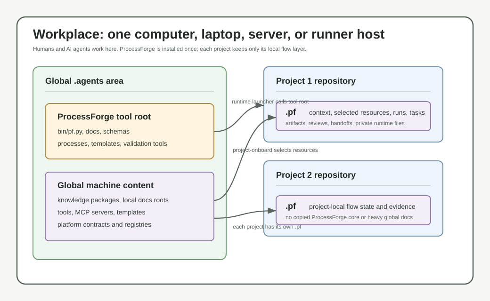

# ProcessForge

**Документация на английском:** [README.md](README.md)

ProcessForge - файловая среда для управляемой работы человека и ИИ-агентов над
проектами. Она хранит описания процессов, запуски, задачи, итерации,
артефакты, проверки, передачи между участниками, пакеты знаний (knowledge
packages), шаблоны, инструменты, регистрации MCP и платформенные контракты
(platform contracts) в версионируемых файлах.

Этот README написан для человека. Он начинается с модели рабочего места и даёт
готовые промпты для оператора. ИИ-агенты должны использовать командный
справочник в
[docs/ru/getting-started/agent-prompts.md](docs/ru/getting-started/agent-prompts.md);
там перечислены только команды и механики, подтверждённые текущей кодовой базой.



## Что такое ProcessForge

Рабочее место (workplace) - это физическая или виртуальная машина, где работают
человек и ИИ-агенты: компьютер, ноутбук, сервер или узел выполнения. ProcessForge
устанавливается один раз как инструмент этого рабочего места.

## Основные сущности

Workplace хранит общие ресурсы машины: описания процессов, пакеты знаний,
повторно используемые шаблоны, регистрации инструментов, регистрации MCP,
платформенные контракты, корневые пути, реестры, кэш, события выполнения и
журналы.

Каждый проект хранит собственный слой `.pf/`. Проектный слой содержит project
context, выбранные глобальные ресурсы, назначения, запуски, задачи, итерации,
артефакты, проверки, передачи, hooks и закрытые файлы среды выполнения.

## Режимы работы

Для человека ProcessForge проще понимать через два рабочих образа.

Первый образ - гараж с инструментами. Это обычный режим `1-1-1-1`: один
оператор, один основной агент, один проект и один активный process/run. Агент
работает как мастер в своём гараже: берёт нужные инструменты, читает нужные
знания, ведёт артефакты процесса, запускает проверки и возвращает результат.
Agent Director здесь не нужен; Worker и Inspector остаются ролями или фазами
той же агентской сессии.

Базовый промпт для такого режима:

```text
Инициализируй проект по ProcessForge, подключи все необходимые инструменты и
знания, мы делаем <название того, что делаем>. Заполняй все требуемые артефакты.
```

Пример для разработки Joomla-плагина:

```text
Инициализируй проект по ProcessForge, подключи все необходимые инструменты и
знания для разработки Joomla-плагина. Мы делаем контентный плагин Joomla,
который добавляет AI-пояснение к материалам сайта. Заполняй все требуемые
артефакты, фиксируй решения по архитектуре, реализации, проверкам и поставке.
```

Второй образ - кузница или фабрика. Это мультиагентный режим: несколько
параллельных агентов получают изолированные задачи, Agent Director координирует
их работу, Agent Ledger ведёт журнал вахтёра, а handoffs и process transitions
передают результаты между участниками и процессами. Такой режим нужен для
сложных процессов: ветвлений, дочерних процессов, возврата в родительский
процесс с результатами, внешних runtime workers и проверяемых параллельных
веток работы. См. подробнее в
[модели агентской сессии](docs/ru/concepts/agent-session-model.md).

Workplace может быть Director-capable, а отдельные проекты при этом остаются
simple. Режим координации проекта вычисляется как `simple`, `organized` или
`inherit` от значения по умолчанию в workplace. `organized` нужен только тем
проектам, которые должны использовать Director Office рабочего места; simple
projects сохраняют обычный сценарий 1-1-1-1.

Process definitions описывают механику процесса. Это YAML-конструкторы с
произвольным количеством стадий, ролей, артефактов, контрольных ворот,
capabilities, разрешённых инструментов и hooks. Им не нужно называть конкретную
платформу реализации.

Platform contracts - композиционные сущности для конкретного проектного
контекста. Платформа может быть одиночной или составной: parent плюс child.
Контракт подключает обязательный и рекомендуемый стек пакетов знаний, шаблонов,
инструментов, MCP providers, capabilities, процессов, стандартов кода,
подсказок типа проекта и политик. Ядро ProcessForge разрешает эти контракты из
манифестов; в коде ядра нет жёсткой привязки к конкретным продуктам, CMS,
фреймворкам, маркетплейсам или предметным областям.

## Как связаны слои

Используйте ProcessForge снаружи внутрь:

1. ProcessForge tool root: установленный CLI, встроенные процессы, схемы,
   проверки, документация и шаблоны промптов.
2. Workplace: состояние машины и повторно используемые ресурсы, общие для
   проектов.
3. Ресурсы workplace: корни и пакеты знаний, шаблоны, инструменты, MCP
   providers, корни пакетов, описания процессов и платформенные контракты.
4. Project `.pf/`: project context, выбранные ресурсы, назначения, запуски,
   задачи, итерации, артефакты, проверки, передачи и hooks.

Проектный слой зависит от workplace. В проект не нужно копировать исходники
ProcessForge, тяжёлые зеркала документации, общие toolchains или содержимое
глобальных ресурсов.

## Порядок инициализации

Для нового рабочего места используйте такой порядок:

1. Установить дистрибутив ProcessForge.
2. Проверить дистрибутив ProcessForge.
3. По умолчанию запустить пошаговую настройку workplace с участием человека.
4. Настроить константы путей и корневые каталоги.
5. Настроить корни знаний, особенно корни локальной документации.
6. Зарегистрировать инструменты и MCP servers.
7. Создать или импортировать пакеты знаний.
8. Создать повторно используемые шаблоны.
9. Создать platform contracts из уже готовых ресурсов.
10. Подключить проекты к workplace.
11. Создать рабочие сценарии run/task для реальной работы.
12. Создать собственные процессы, если встроенной механики недостаточно.

Не начинайте с platform contract, если его обязательные packages, templates,
tools, MCP servers, processes, coding standards или capabilities ещё не
существуют. Сначала создайте или зарегистрируйте зависимости, затем собирайте
платформу.

Используйте `workplace-setup` как путь по умолчанию, когда ИИ-агент настраивает
новую машину вместе с человеком. Агент задаёт вопросы блоками, пишет
`answers.yaml`, готовит `proposal.md`, просит подтверждение, применяет
workplace, запускает `doctor-workplace` и только потом переходит к созданию
ресурсов или подключению проекта.

Используйте `first-run`, `workplace-init` и прямые create/register команды как
полностью автоматический путь только когда оператор явно просит автоматизацию и
даёт нужные пути и ответы.

## Быстрый старт

1. Прочитайте этот README, чтобы понять модель и границы.
2. Откройте [промпты быстрого старта](QUICKSTART.ru.md) и скопируйте промпт
   настройки в ИИ-агента.
3. Дайте агенту провести пошаговую настройку workplace.
4. Создайте или зарегистрируйте ресурсы workplace: знания, шаблоны,
   инструменты, MCP providers, корни пакетов и platform contracts.
5. Подключайте первый проект только после готовности workplace и общих ресурсов.
6. Внутри проекта начинайте каждую ProcessForge-сессию с
   `.pf/START_AGENT_HERE.md`.

## Поддерживаемые мастера и команды создания

ProcessForge сейчас поддерживает файловые сценарии создания:

- workplace initialization: `workplace-init` / `init-workplace`
- guided workplace setup: `workplace-setup start`, `workplace-setup review`,
  `workplace-setup apply` и `workplace-setup status`
- project onboarding: `project-onboard` / `init-project`
- first run bootstrap: `first-run`
- process authoring: `process-authoring-start`, `process-authoring-review`,
  `process-authoring-apply` и one-command `process-create`
- knowledge packages: `knowledge-package-create`, `knowledge-add-url`,
  `knowledge-add-resource`, `knowledge-index-refresh`, `knowledge-package-doctor`
- reusable templates: `template-create`, `template-add`, `template-doctor`
- platform contracts: `platform-create`, `platform-contract-install`,
  `platform-contract-doctor`
- tools и MCP providers: `tool-register`, `mcp-register`
- runs, tasks и iterations: `run-create`, `task-create`, `iteration-add`,
  completion, summary и doctor commands
- multi-agent orchestration: `orchestrator-plan create`,
  `orchestrator-plan validate`, `orchestrator-plan apply`,
  `orchestrator-plan status` и `worker-launch-prompt create`
- agent ledger и handoffs: `agent-register`, `agent-checkin`,
  `agent-availability`, `agent-lease-grant`, `process-route-list`,
  `handoff-create`, `handoff-status` и `agent-director-tick`
- coordination modes: `workplace-mode status`, `workplace-mode set`,
  `project-mode status`, `project-mode set`, `director-inbox-submit`,
  `director-case-refresh` и `error-route`
- primary agent sessions: `session-start`, `session-heartbeat`,
  `session-status` и `session-end`
- orchestrator shell agents: `orchestrator-shell-plan-create`,
  `orchestrator-shell-plan-validate` и `orchestrator-shell-plan-apply`
- runtime drivers и worker execution: `runtime-driver list`,
  `runtime-driver validate`, `worker-run prepare`, `worker-run start`,
  `worker-run status`, `worker-run collect`, `supervisor tick`,
  `supervisor run`, а также semantic aliases `execution-inspector-tick` и
  `execution-inspector-run`

`supervisor` - историческое техническое имя команды для Process Execution
Inspector. Он проверяет состояние выполнения назначенного worker; это не Agent
Director. Граница ответственности описана в
[docs/ru/concepts/director-ledger-inspector-boundary.md](docs/ru/concepts/director-ledger-inspector-boundary.md).

Флаг `--interactive` принимается командами first-run initialization ради
совместимости пользовательского опыта, но текущая реализация остаётся файловой
и не требует вопросов в терминале.

## Prompts для оператора

### Подготовить workplace через пошаговую настройку

```text
Настрой ProcessForge на этом устройстве пошагово.
```

### Полностью автоматическая настройка

```text
Настрой ProcessForge на этом устройстве в полностью автоматическом режиме.
Сначала исследуй текущий AGENTS.md и навыки для настройки.
```

В автоматическом режиме агент сначала рассказывает, что нашёл на устройстве,
переводит существующие инструкции, навыки, документы, инструменты, платформы и
корни проектов в будущие сущности ProcessForge, запрашивает подтверждение
сценария настройки и только после этого применяет изменения.

### Подключить проект

```text
Подключи этот проект к существующему ProcessForge workplace.

Сначала изучи проект, выбери консервативный project type, создай проектный
слой .pf, прочитай .pf/START_AGENT_HERE.md, запусти doctor checks и кратко
опиши, что ProcessForge теперь знает о проекте.

Глобальные ресурсы держи в workplace. Не копируй тяжёлую документацию, зеркала
исходного кода, toolchains или репозиторий ProcessForge внутрь проекта.
```

### Собрать platform stack

```text
Создай ресурсы ProcessForge, которые нужны платформе этого проекта.

Иди от зависимостей: зарегистрируй инструменты и MCP servers, создай или
импортируй пакеты знаний, создай повторно используемые шаблоны, затем создай
platform contract, который собирает эти ресурсы. Если у платформы есть parent и
child, опиши наследование в platform manifests и докажи его через platform
doctor и project snapshot.
```

### Начать рабочую сессию

```text
Начни ProcessForge run для этой работы.

Сначала прочитай .pf/START_AGENT_HERE.md. Создай run, разбей работу на явные
задачи, фиксируй итерации work/debug/fix/review, сохраняй артефакты и передачи
в проектной папке .pf, а в конце сделай run summary и doctor check.
```

### Создать процесс

```text
Создай новый ProcessForge process для этого проекта.

Используй process authoring workflow. Спрашивай недостающие решения,
поддерживай ответы authoring и черновик процесса в актуальном состоянии, проверь
semantic parity, применяй process только после review и докажи, что его можно
вывести в списке, описать и использовать для run.
```

## Карта документации

Для человека:

- [Промпты быстрого старта](QUICKSTART.ru.md)
- [Установка и требования](docs/ru/getting-started/installation.md)
- [Пошаговая настройка workplace](docs/ru/getting-started/guided-workplace-setup.md)
- [Порядок инициализации](docs/ru/getting-started/initialization-order.md)
- [Workplace vs project](docs/ru/concepts/workplace-vs-project.md)
- [Создание ресурсов](docs/getting-started/resource-authoring.md)
- [Подключение проекта](docs/ru/getting-started/project-onboarding.md)

Для ИИ-агентов:

- [Командный справочник агента](docs/ru/getting-started/agent-prompts.md)
- [Промпт агента для пошаговой настройки workplace](prompts/guided-workplace-setup-agent.md)
- [Промпт агента для автоматической инициализации workplace](prompts/workplace-initialization-agent.md)
- [Промпт агента для подключения проекта](prompts/project-onboarding-agent.md)
- [Чек-лист релиза](docs/release-checklist.md)

Подробный индекс:

- [Промпты быстрого старта](QUICKSTART.ru.md)
- [Индекс документации](docs/ru/index.md)
- [Установка и требования](docs/ru/getting-started/installation.md)
- [Порядок инициализации](docs/ru/getting-started/initialization-order.md)
- [Командный справочник агента](docs/ru/getting-started/agent-prompts.md)
- [Workplace vs project](docs/ru/concepts/workplace-vs-project.md)
- [Модель среды выполнения](docs/ru/concepts/runtime-model.md)
- [Модель агентской сессии](docs/ru/concepts/agent-session-model.md)
- [Режимы координации проекта](docs/ru/concepts/project-coordination-modes.md)
- [Платформенные контракты](docs/ru/concepts/platform-contracts.md)
- [Наследование платформ](docs/ru/concepts/platform-inheritance.md)
- [Навигация по ресурсам знаний](docs/ru/concepts/knowledge-resource-navigation.md)
- [Площадки обновлений](docs/ru/concepts/update-sites.md)
- [Жизненный цикл обновлений](docs/ru/concepts/update-lifecycle.md)
- [Система обновлений](docs/ru/getting-started/update-system.md)
- [Runs, tasks и iterations](docs/ru/concepts/runs-tasks-iterations.md)
- [Паритет authoring](docs/ru/authoring/authoring-parity.md)
- [Ограничения](docs/ru/known-limitations.md)

## Требования

Требования к среде выполнения:

- Рекомендуется Python 3.11+.
- Python 3.10+ допустим только если текущие tests подтверждают совместимость.
- Зависимости Python-пакетов описаны в `requirements.txt`, сейчас это `PyYAML`.
- Нужна файловая система с UTF-8.
- Пользователю или агенту нужен доступ на чтение и запись к дистрибутиву
  ProcessForge, workplace и каталогам проектов.
- Для обычного использования PowerShell не требуется.
- В файловом режиме ProcessForge не требует демона или фонового процесса.

Требования к разработке и проверкам релиза:

- Python 3.11+.
- Зависимости Python-пакетов из `requirements.txt`.
- Git для установки из исходного кода и проверок релиза, например
  `git diff --check`.
- Возможность запускать дочерние процессы и создавать временные каталоги.
- Поддержка ZIP из стандартной библиотеки Python.
- Тесты обновлений детерминированы: public release checks используют локальные
  file-provider fixtures и не требуют реальной сети.

Необязательные интеграции: MCP servers, внешние инструменты, проверки в браузере
и сценарии работы с системой контроля версий. Использование из релизного архива
не требует Git, если пользователю не нужна интеграция с системой контроля
версий.

## ProcessForge и агентские среды

Не копируйте весь репозиторий ProcessForge в `.codex`, `.claude`, `.agents` или
похожие папки конфигурации агентов.

Установите ProcessForge один раз как инструмент, инициализируйте workplace и
добавьте короткую инструкцию в конфигурацию агента: где установлен ProcessForge
и что проектные инструкции находятся в `.pf/START_AGENT_HERE.md`.

## Лицензия

См. [LICENSE](LICENSE).
# Lock-модель проектного контекста

`.pf/process-forge.yaml` объявляет `context_requirements`, а
`project-context-refresh` записывает разрешённый lock в
`.pf/contexts/project-context.snapshot.yaml` и поколения в
`.pf/contexts/project-context.snapshots/`. `project-context-check` возвращает
`fresh`, `fresh_with_updates`, `stale` или `broken`. Assignment capsules
закрепляют snapshot id/checksum и не перепривязываются при последующих
обновлениях.
