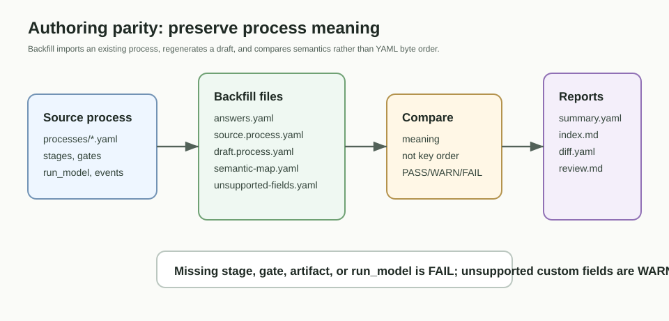

# Authoring Parity



Authoring parity проверяет, можно ли существующий process definition
backfill-нуть в authoring answers и получить семантически эквивалентный draft.

```bash
python .pf/runtime/bin/pf.py process-authoring-import --project-root . --process <process-id> --apply
python .pf/runtime/bin/pf.py process-parity-check --project-root . --process <process-id>
python .pf/runtime/bin/pf.py process-parity-check-all --project-root .
python .pf/runtime/bin/pf.py authoring-parity-check-all --project-root .
```

Проверка сравнивает смысл: stages, gates, artifact definitions, run model,
events и required resources. Порядок ключей YAML и форматирование не считаются
семантической разницей.

Resource parity для templates, knowledge packages и platform contracts в v0.1
является поверхностным и сообщает WARN, пока нет полного authoring round-trip.
