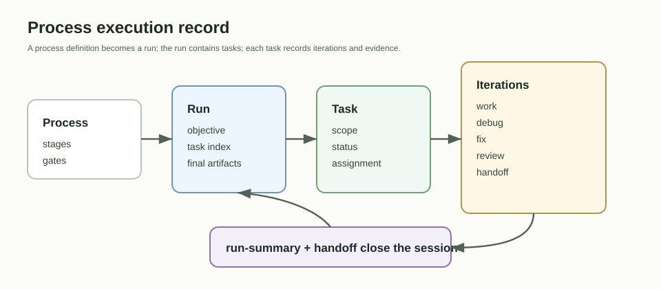

# Runtime Model

В v0.1 ProcessForge работает через короткие CLI-команды. Команда читает файлы
workplace и project, записывает нужный artifact или runtime record, emits events
и завершается.

Основные runtime files:

- `.pf/process-forge.yaml`;
- `.pf/contexts/`;
- `.pf/runs/`;
- `.pf/assignments/`;
- `.pf/artifacts/`;
- `.pf/reviews/`;
- `.pf/handoffs/`;
- `.pf/runtime/events/events.ndjson`.

Долгоживущий watcher или runner может появиться отдельным слоем позже, но
текущий релиз не требует daemon.
